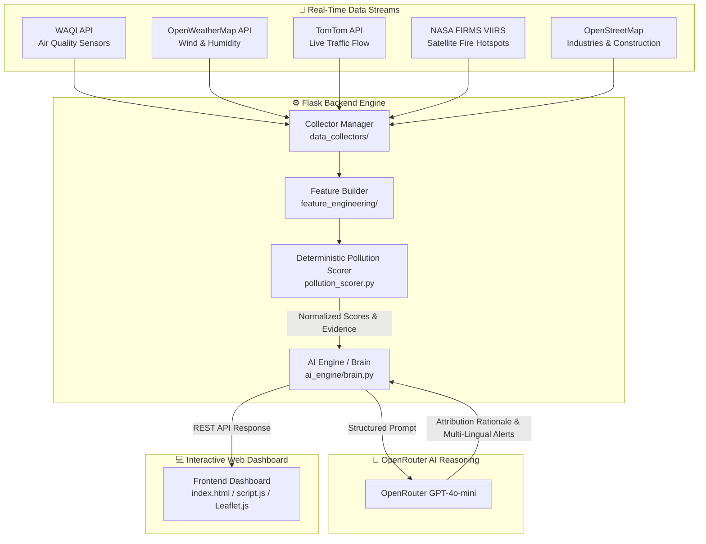

# 🌬️ AirSense India — AI-Powered Urban Air Quality & Source Attribution Intelligence

> **Official Submission for ET AI Hackathon 2026**  
> *Transforming raw environmental sensor data into actionable, explainable, and real-time pollution intelligence for Indian cities.*

---

## 📌 Executive Summary

Traditional air quality platforms answer **"What is the AQI?"** but leave citizens and government authorities guessing **"Why is the AQI high?", "Who or what is responsible?", and "What exact steps must be taken right now?"**

**AirSense India** is a next-generation environmental intelligence platform that fuses **5 real-time data streams** (sensor stations, satellite active fire detection, live traffic flows, weather dynamics, and geospatial infrastructure mapping) through a hybrid **Deterministic Evidence Engine + LLM Scientific Reasoning Engine**.

Instead of treating AI as a black box that fabricates numbers, AirSense India calculates exact mathematical attribution scores across **Dust, Traffic, Industry, and Biomass/Stubble Fires**, then leverages **OpenRouter AI (GPT-4o-mini)** to generate scientific explanations, policy actions for governments, and multi-lingual health advisories for citizens.

---

## ✨ Key Features

- 🛰️ **Multi-Source Real-Time Data Ingestion**:
  - **WAQI (World Air Quality Index)**: Live station readings for PM2.5, PM10, NO₂, SO₂, CO, O₃, and daily forecasts.
  - **OpenWeatherMap**: Wind speed, wind direction, temperature, and humidity.
  - **TomTom Traffic API**: Live speed, free-flow comparison, traffic congestion percentages, and road closures.
  - **NASA FIRMS (VIIRS Satellite)**: Real-time active thermal fire hotspots within 150 km.
  - **OpenStreetMap (Overpass API)**: Spatial proximity mapping for heavy industrial zones and construction sites.

- 📐 **Deterministic Evidence Engine**:
  - Rule-based weighting algorithm that evaluates chemical markers (e.g., SO₂ for industry, NO₂/CO for traffic, PM10 for dust, PM2.5 + thermal brightness for fire).
  - Produces normalized percentage attribution scores (Dust %, Traffic %, Industry %, Fire %) that always total 100%.

- 🧠 **Explainable AI Reasoning (Powered by OpenRouter)**:
  - Consumes exact evidence scores without hallucinating fake percentages.
  - Generates clear scientific rationale on primary vs. secondary pollution sources.
  - Explains why alternative sources were ruled out based on available evidence.

- 🏛️ **Actionable Policy Directives & Multi-Lingual Citizen Alerts**:
  - **Government Actions**: Targeted municipal interventions (e.g., anti-smog guns, traffic rerouting, industrial audits).
  - **Citizen Health Alerts**: Real-time advice localized into **English, Hindi (हिंदी), Telugu (తెలుగు), and Kannada (ಕನ್ನಡ)**.

- 🗺️ **Interactive Geo-Spatial Dashboard**:
  - Clean, responsive UI with **Leaflet.js** map visualization, live AQI gauges, pollutant level meters, wind compass, traffic congestion progress bars, and active fire warning badges.

---

## 🏗️ System Architecture



---

## 🛠️ Technology Stack

| Layer | Technology / Service |
| :--- | :--- |
| **Frontend** | HTML5, Modern CSS (Glassmorphism), Vanilla JavaScript, Leaflet.js, FontAwesome |
| **Backend** | Python 3.9+, Flask, Flask-CORS, `requests`, `python-dotenv` |
| **AI Reasoning** | OpenRouter API (OpenAI GPT-4o-mini integration) |
| **Data Ingestion** | WAQI API, OpenWeatherMap API, TomTom Traffic API, NASA FIRMS CSV API, Overpass OSM API |
| **Environment** | Cross-platform, `.env` secret management |

---

## 📁 Project Structure

```
air-quality-intelligence/
├── ai_engine/
│   ├── brain.py                # OpenRouter AI integration & JSON response parser
│   └── prompts.py              # Scientific prompt engineering & reasoning rules
├── backend/
│   └── app.py                  # Flask REST API server (Endpoints: /api/cities, /api/areas, /api/analyze)
├── data_collectors/
│   ├── collector_manager.py    # Parallel multi-source data ingestion orchestrator
│   ├── aqi_fetcher.py          # WAQI API client
│   ├── weather_fetcher.py      # OpenWeatherMap API client
│   ├── traffic_fetcher.py      # TomTom Traffic API client
│   ├── fire_fetcher.py         # NASA FIRMS satellite active fire client
│   ├── osm_fetcher.py          # OpenStreetMap industrial/construction client
│   └── areas.py                # Indian city & neighborhood coordinate mapping
├── feature_engineering/
│   ├── feature_builder.py      # High-level feature builder & threshold detection
│   └── pollution_scorer.py     # Deterministic mathematical evidence scoring engine
├── frontend/
│   ├── index.html              # Dashboard layout & controls
│   ├── style.css               # Modern dark-mode UI styling
│   └── script.js               # Dynamic API client, Leaflet map renderer & multi-lingual tab handler
├── docs/
│   └── master_plan.md          # Problem statement & project roadmap
├── config.py                   # Environment configuration loader (zero hardcoded secrets)
├── utils.py                    # Geospatial distance calculations (Haversine formula)
├── requirements.txt            # Python dependencies
├── .env.example                # Template for environment variables
└── README.md                   # Project documentation
```

---

## 🔒 Security & Data Privacy

- **No Secrets in Source Control**: All API keys and credentials have been completely decoupled from the codebase and are loaded dynamically via `python-dotenv` and environment variables.
- **Git Protection**: `.env`, `.env.local`, `__pycache__`, and virtual environment paths are explicitly locked in `.gitignore`.
- **Public Safety**: `.env.example` is provided as a clean setup template for hackathon verifiers.

---

## 🚀 Quick Start & Installation

### 1. Prerequisites
- Python 3.9 or higher
- Git
- Web browser (Chrome, Firefox, Safari, Edge)

### 2. Clone Repository
```bash
git clone https://github.com/your-username/air-quality-intelligence.git
cd air-quality-intelligence
```

### 3. Create & Activate Virtual Environment
```bash
# macOS / Linux:
python3 -m venv venv
source venv/bin/activate

# Windows:
python -m venv venv
venv\Scripts\activate
```

### 4. Install Dependencies
```bash
pip install -r requirements.txt
```

### 5. Configure Environment Variables
Copy the `.env.example` file to `.env`:
```bash
cp .env.example .env
```
Open `.env` and fill in your API keys:
```env
WAQI_API_KEY=your_waqi_api_key_here
OPENWEATHER_API_KEY=your_openweather_api_key_here
TOMTOM_API_KEY=your_tomtom_api_key_here
NASA_FIRMS_KEY=your_nasa_firms_key_here
OPENROUTER_API_KEY=your_openrouter_api_key_here
```

> 💡 *Note: All data collectors include safe fallbacks so the application degrades gracefully even if an individual key is missing or rate-limited.*

### 6. Run the Flask Backend
```bash
python backend/app.py
```
The backend server will start at: `http://127.0.0.1:5000`

### 7. Launch Frontend Dashboard
Open `frontend/index.html` directly in your browser, or serve it using Python:
```bash
cd frontend
python -m http.server 8000
```
Then open `http://localhost:8000` in your web browser.

---

## 📡 API Reference

### 1. Health Check
`GET /api/health`
```json
{ "status": "ok" }
```

### 2. List Supported Cities
`GET /api/cities`
```json
{
  "cities": [
    { "name": "Bengaluru", "lat": 12.9716, "lon": 77.5946 },
    { "name": "Delhi", "lat": 28.6139, "lon": 77.2090 },
    { "name": "Mumbai", "lat": 19.0760, "lon": 72.8777 }
  ]
}
```

### 3. List City Neighborhoods / Areas
`GET /api/areas?city=Bengaluru`
```json
{
  "areas": [
    { "name": "Silk Board", "lat": 12.9172, "lon": 77.6228 },
    { "name": "Whitefield", "lat": 12.9698, "lon": 77.7500 },
    { "name": "Peenya Industrial Area", "lat": 13.0324, "lon": 77.5214 }
  ]
}
```

### 4. Analyze Air Quality & Pollution Attribution
`GET /api/analyze?city=Bengaluru&area=Peenya%20Industrial%20Area`

**Sample Response**:
```json
{
  "success": true,
  "city": "Bengaluru",
  "area": "Peenya Industrial Area",
  "aqi_data": {
    "aqi": 182,
    "pm25": 112,
    "pm10": 165,
    "no2": 38,
    "so2": 42,
    "dominant_pollutant": "PM2.5"
  },
  "features": {
    "aqi_category": "Unhealthy",
    "pollution_scores": {
      "Industry": 45,
      "Dust": 30,
      "Traffic": 25,
      "Fire": 0
    }
  },
  "ai_analysis": {
    "primary_source": "Industry",
    "primary_confidence": 45,
    "secondary_sources": [
      { "source": "Dust", "confidence": 30 },
      { "source": "Traffic", "confidence": 25 }
    ],
    "reasoning": "Elevated SO₂ levels (42 μg/m³) alongside high concentrations of nearby industrial facilities in Peenya confirm industrial emissions as the primary contributor. High PM10 accounts for secondary dust pollution.",
    "government_actions": [
      "Conduct immediate emission audits on factories operating in Peenya Phase 1 & 2.",
      "Deploy mobile anti-smog mist cannons along major arterial industrial roads."
    ],
    "citizen_alert_english": "Air quality is Unhealthy. Sensitive groups and children should avoid prolonged outdoor exposure.",
    "citizen_alert_hindi": "वायु गुणवत्ता अस्वास्थ्यकर है। संवेदनशील समूहों को बाहर निकलने से बचना चाहिए।"
  }
}
```

---

## 🌇 Supported Metropolitan Regions

Currently pre-configured with granular neighborhood-level tracking for major Indian urban hubs:
- **Bengaluru** (Silk Board, Whitefield, Peenya, Electronic City, Majestic, Indiranagar)
- **Delhi** (Anand Vihar, RK Puram, Punjabi Bagh, ITO, Dwarka, Jahangirpuri)
- **Mumbai** (BKC, Chembur, Andheri, Worli, Navi Mumbai)
- **Chennai** (Manali, Guindy, Velachery, Central)
- **Kolkata** (Jadavpur, Rabindra Bharati, Victoria, Salt Lake)
- **Hyderabad** (Sanathnagar, Gachibowli, Punjagutta, Charminar)
- **Pune** (Shivajinagar, Hadapsar, Bhosari, Katraj)
- **Ahmedabad** (Maninagar, Satellite, Vatva Industrial Estate)

---

## 🏆 Hackathon Submission Metadata

- **Hackathon**: Economic Times (ET) AI Hackathon 2026
- **Track**: AI for Social Good & Urban Sustainability
- **Repository Link**: [GitHub Repository](https://github.com/your-username/air-quality-intelligence)
- **License**: MIT License

---

<p center>
  Made with ❤️ for cleaner air and healthier cities across India.
</p>
