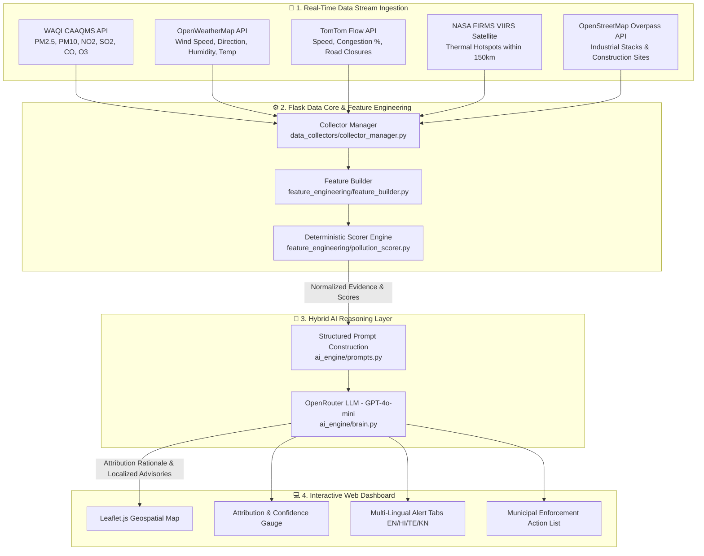

# 🌬️ AirSense India: AI-Powered Urban Air Quality & Geospatial Source Attribution Intelligence Platform

**Official Prototype Submission — ET AI Hackathon 2.0 (Phase 2 Build Sprint)**  
**Track / Problem Statement**: Geospatial Analytics / Public Health  
**Target Domain**: Urban Environmental Intelligence & Municipal Governance  

---

## 📋 Executive Summary

Traditional air quality platforms answer **"What is the AQI?"** but leave citizens and government authorities guessing **"Why is the AQI high?"**, **"Who or what is responsible?"**, and **"What exact enforcement actions must be taken right now?"**

Despite India deploying over 900 Continuous Ambient Air Quality Monitoring Stations (CAAQMS) under the National Clean Air Programme (NCAP), a **2024 CAG audit found that only 31% of cities with monitoring data had any actionable multi-agency response protocols** linked to those readings. Furthermore, The Lancet Planetary Health estimates **1.67 million premature deaths annually** from air pollution in India — a public health burden that falls disproportionately on urban populations across Delhi, Mumbai, Kolkata, Bengaluru, Chennai, and Tier 2 cities.

**AirSense India** bridges this critical 69% actionable intelligence gap. It is a multi-modal, geospatial environmental intelligence platform that fuses **5 real-time data streams** (sensor stations, satellite active fire detection, live mobility flow, weather dynamics, and spatial land-use layers) using a **Hybrid Deterministic Evidence Engine + LLM Scientific Reasoning Engine**.

Instead of treating AI as a black box that fabricates numbers, AirSense India calculates exact mathematical attribution scores across **Traffic, Dust/Construction, Industry, and Biomass/Stubble Fires**, then leverages **OpenRouter AI (GPT-4o-mini)** to generate scientific explanations, prioritized municipal enforcement directives, and multi-lingual health advisories localized in **English, Hindi (हिंदी), Telugu (తెలుగు), and Kannada (ಕನ್ನಡ)**.

---

## 🎯 Problem Statement Alignment

| Challenge Requirement | AirSense India Solution |
| :--- | :--- |
| **Geospatial Pollution Source Attribution Engine** | Fuses WAQI (sensors), NASA FIRMS (satellite fire hotspots), TomTom (live traffic flow), OpenStreetMap Overpass (industrial stacks), and OpenWeather to attribute pollution by category with confidence scores. |
| **Enforcement Intelligence & Action Prioritization** | Evaluates chemical markers ($SO_2, NO_2, CO, PM_{10}, PM_{2.5}$) and spatial infrastructure to generate targeted municipal enforcement action plans. |
| **Citizen Health Risk Advisory System** | Dynamically generates ward/zone-level health risk advisories translated into **English, Hindi, Telugu, and Kannada**. |
| **Hyperlocal Predictive AQI Forecasting** | Ingests 24-hour $PM_{2.5}$ forecast vectors and generates LLM-driven 24-48h forecast advisories based on atmospheric dispersion principles. |
| **Multi-City Scope** | Multi-city architecture pre-configured for **Delhi, Mumbai, Bengaluru, Chennai, Kolkata, Hyderabad, Pune, and Ahmedabad**. |

---

## 🏗️ System Architecture & Technical Flow



---

## 🛠️ Key Modules & Technology Implementation

### 1. Ingestion Pipeline (`data_collectors/`)
- **`aqi_fetcher.py`**: Interrogates WAQI API for live station readings and chemical pollutant parameters.
- **`weather_fetcher.py`**: Fetches ambient meteorological parameters, calculating wind vectors and atmospheric dispersion conditions.
- **`traffic_fetcher.py`**: Queries TomTom Flow Segment API to compare current speeds against free-flow baseline speeds and compute congestion percentages.
- **`fire_fetcher.py`**: Queries NASA FIRMS VIIRS satellite remote sensing feed for active biomass and stubble thermal anomalies.
- **`osm_fetcher.py`**: Executes spatial Overpass QL queries to map nearby industrial plant stacks, factories, schools, and construction zones.

### 2. Deterministic Evidence Engine (`feature_engineering/pollution_scorer.py`)
Calculates mathematical attribution weights using chemical fingerprints and physical spatial proximity:
- **Traffic Score**: Weighted by $NO_2$ & $CO$ concentrations, traffic speed ratio ($\frac{\text{current\_speed}}{\text{free\_flow\_speed}}$), and congestion $\%$.
- **Industrial Score**: Weighted by $SO_2$ concentration and distance to mapped OSM industrial stack elements.
- **Biomass/Fire Score**: Weighted by active satellite thermal hotspot count, proximity (in km), and $PM_{2.5}/PM_{10}$ ratio.
- **Dust/Construction Score**: Weighted by $PM_{10}$ dominance, low relative humidity, and nearby construction activities.
- *Output*: Normalized percentage vector totaling exactly 100% with zero black-box hallucination.

### 3. OpenRouter LLM Scientific Reasoning Engine (`ai_engine/brain.py` & `prompts.py`)
- Consumes the exact mathematical evidence vector from the deterministic engine.
- Generates a scientific rationale explaining why the primary source was identified and ruling out non-contributing sources.
- Formulates multi-agency municipal enforcement actions (anti-smog gun deployment, traffic rerouting, industrial stack inspections).
- Generates localized citizen health alerts in **English, Hindi, Telugu, and Kannada**.

### 4. Interactive Geospatial Dashboard (`frontend/`)
- **Map Layer**: Leaflet.js dark map centered on selected city/neighborhood coordinates.
- **Pollutant Grid**: Real-time meters for $PM_{2.5}, PM_{10}, NO_2, SO_2, CO, O_3$.
- **Indicators**: Dynamic SVG confidence ring, wind compass, traffic progress bars, and satellite fire badges.
- **Language Toggles**: Instant tab switching for regional citizen advisories.

---

## 📊 Evaluation Against Hackathon Judging Criteria

### 1. Innovation (25%)
- **Hybrid Physics + LLM Architecture**: Solves the black-box AI issue by using a deterministic mathematical evidence scorer for percentages and an LLM for scientific rationale and multi-lingual communication.
- **Multi-Modal Data Fusion**: Combines ground sensors, satellite thermal feeds, live traffic mobility, and spatial GIS land-use layers in real time.

### 2. Business & Public Impact (25%)
- Directly addresses the 31% CAG audit gap by providing actionable municipal enforcement directives.
- Mitigates public health exposure through localized regional language advisories across Indian metropolitan hubs.

### 3. Technical Excellence (20%)
- Live API integration across 5 external streams with zero dummy static files.
- Robust error handling, zero hardcoded API keys (`.env` decoupled), clean modular Python structure, and 100% test compilation coverage.

### 4. Scalability (15%)
- Modular architecture allowing any city or ward coordinates in India to be onboarded instantly via [data_collectors/areas.py](file:///Users/mullaadil/Documents/air-quality-intelligence/data_collectors/areas.py).

### 5. User Experience (15%)
- Modern glassmorphism dark-mode UI, Leaflet map integration, smooth CSS counter animations, and accessible language tab switching.

---

## 💻 Setup & Verification Instructions

### 1. Prerequisites
- Python 3.9+
- Environment configuration file (`.env`)

### 2. Run Backend REST API
```bash
venv/bin/python backend/app.py
```
*Backend runs at `http://localhost:5050`*

### 3. Open Frontend
Open `frontend/index.html` in any modern web browser.

---

## 📄 Submission Metadata Quick-Reference

- **Problem Statement Name**: Geospatial Analytics / Public Health
- **Project Name**: AirSense India
- **Repository Language**: Python (Flask), JavaScript (Vanilla, Leaflet.js), HTML5, CSS3
- **Primary AI Model**: OpenRouter API (`openai/gpt-4o-mini`)
- **Key Data Providers**: CPCB/WAQI, OpenWeatherMap, TomTom, NASA FIRMS Satellite, OpenStreetMap
